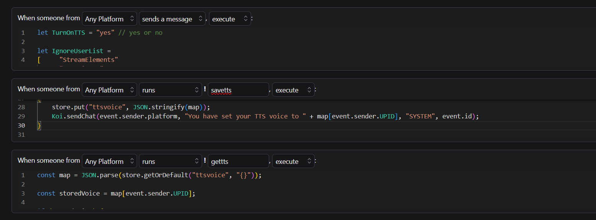

# Chat Group TTS Script

## Setup Instructions for Streamers

To set up the scripts for your chat group, follow these steps:

1. **Configure `chatgroup_tts.js`**:
   - Set it up to trigger as:
     - **When someone from 'Any Platform' 'sends a message', 'execute'**.

2. **Configure `savetts.js`**:
   - Set it up to trigger as:
     - **When someone from 'Any Platform' 'runs' ! 'savetts', 'execute'**.

3. **Configure `gettts.js`**:
   - Set it up to trigger as:
     - **When someone from 'Any Platform' 'runs' ! 'gettts', 'execute'**.

4. **Screenshot**:
   - Refer to the screenshot below for an example of the TTS setup in action:
     

---

## Setup Instructions for Viewers

To set up the TTS functionality for your chat group, follow these steps:

1. **Save a TTS Voice**:
   - Use the `savetts.js` script to set a TTS voice for a user.
   - Example: Run the command `!savetts <voice_name>` in your chat to save a voice. The available voices include:
     - **Dansk**: Naja, Mads
     - **Deutsch**: Marlene, Hans
     - **English**: Russell, Nicole, Amy, Brian, Matthew, Raveena, Ivy, Joey, Joanna, Salli
     - **Español**: Enrique, Lucia, Mia, Penélope
     - **Français**: Chantal, Léa, Céline, Mathieu
     - **Português**: Inês, Cristiano, Vitória, Ricardo

2. **Retrieve the Current TTS Voice**:
   - Use the `gettts.js` script to check the current TTS voice for a user.
   - Example: Run the command `!gettts` in your chat to see the saved voice.

---

## Technical Details

### Scripts Overview

- **`savetts.js`**:
  - Saves a user's preferred TTS voice to persistent storage.
  - Validates the voice against a predefined list of allowed voices.
  - Updates the storage and sends a confirmation message to the user.

- **`gettts.js`**:
  - Retrieves the saved TTS voice for a user from persistent storage.
  - Sends a message to the user with their current TTS voice or prompts them to set one if not already set.

- **`chatgroup_tts.js`**:
  - Processes chat messages and plays them as TTS audio.
  - Filters messages based on user-defined ignore lists and conditions.
  - Uses the saved TTS voice for each user or defaults to "Polly Matthew" if no voice is set.

### Key Features

- **Voice Storage**:
  - User-specific TTS voices are stored in a JSON object using the `store` API.

- **Message Filtering**:
  - Messages containing specific phrases or sent by ignored users are skipped.

- **TTS Playback**:
  - Uses the `Sound.playTTS` function to play messages with the selected voice.

- **Customization**:
  - Easily configurable ignore lists and default settings.

### Dependencies

- `store`: Used for persistent storage of user preferences.
- `Koi`: Handles chat interactions and sends messages.
- `Sound`: Plays TTS audio.

For further customization or troubleshooting, refer to the source code of each script.
